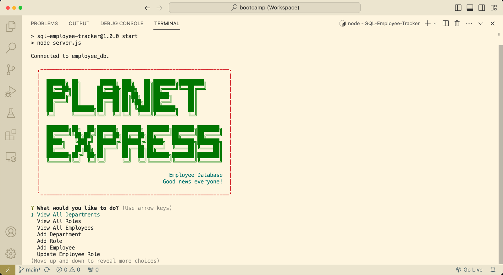

# SQL Employee Tracker

## Description
An employee database and management system that allows a user to view, add, and update assorted employee information, such as Job Titles, Managers, and Departments.

### Installation
Fork [this repository](https://github.com/morgs999/SQL-Employee-Tracker). 
In your command line run `npm install`. 
Then run `npm start`.

### Usage
 - View [Video Walkthrough](https://drive.google.com/file/d/1uxWuCXwpJVXXhsrWu5Oton4ZHTH68zjf/view?usp=sharing).
 - Upon installation, the user is presented with a "Main Menu" which they will be returned to upon completing any single command.
 - Users are able to view the current list of departments, job roles, or employees.
 - Users can add a department, job role, or employee, and are led through a series of choices to correctly integrate with the SQL database.
 - Users can also update the current job role for any employee.

#### Credits
https://futurama.fandom.com/wiki/Planet_Express_Crew 
https://www.npmjs.com/package/inquirer 
https://www.npmjs.com/package/mysql2 
https://www.npmjs.com/package/asciiart-logo 

#### License
No License provided.